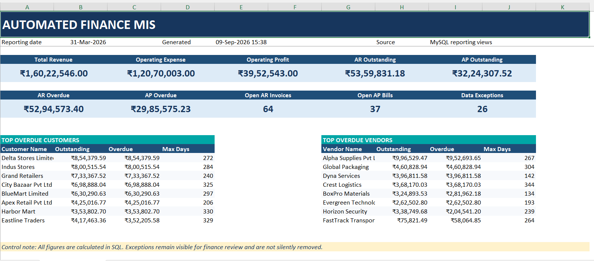
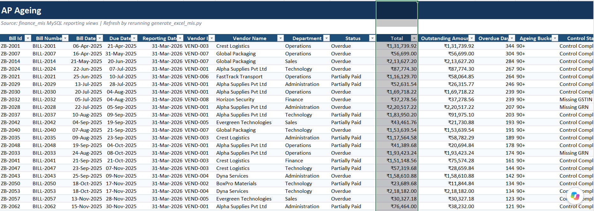
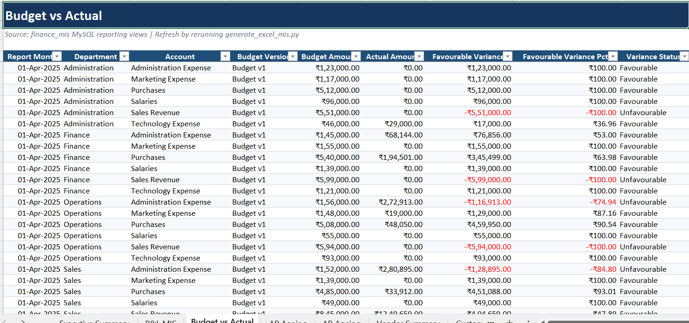

# Automated Finance MIS Pipeline

## Live Finance MIS Application


🔗 [Launch Zoho Finance MIS Automation](https://akshayfinancemis.streamlit.app)

▶️ [Watch the Demo Video](https://raw.githubusercontent.com/Akshay60313/finance-mis-automation/main/screenshots/streamlit_demo.mp4)

### Overview

This project automates the conversion of seven Zoho Books-style exports into a validated, reconciled and downloadable multi-tab Excel MIS pack.

**Workflow:** Zoho exports → Python validation → SQL processing → financial controls → Excel MIS → browser download

### Reports Generated

- Executive Summary and P&L
- Budget versus Actual
- AR and AP Ageing
- Customer and Vendor Outstanding
- Data Exception Report

### Demonstration Results

- 2,171 source records processed
- 26 controlled data exceptions
- ₹0.00 general-ledger difference
- Automated Excel output through a public Streamlit application

> The demonstration uses synthetic financial data. Do not upload confidential company information to the public application.

An end-to-end finance reporting project that converts Zoho-style accounting exports into a validated MySQL data model and a management-ready Excel MIS.

> This repository uses synthetic demonstration data. It does not contain confidential company, customer or vendor information.



## Business problem

Finance teams often spend significant time exporting accounting data, cleaning inconsistent fields, reconciling balances and preparing recurring Excel reports. Manual handling increases turnaround time and creates a risk of duplicate, missing or incorrectly classified records.

This project creates a repeatable reporting pipeline from source files to management outputs.

## Automated workflow


## What the pipeline does

1. Reads sales, purchase, payment, expense, budget and general-ledger exports.
2. Standardises column names, dates and numeric fields.
3. Checks mandatory fields, duplicates and accounting consistency.
4. Records data-quality exceptions instead of silently deleting them.
5. Loads validated records into MySQL tables.
6. Creates reusable SQL views for finance reporting.
7. Generates a formatted Excel management pack automatically.

## Excel MIS outputs

- Executive finance summary
- Monthly P&L MIS
- Budget versus actual analysis
- Accounts payable ageing
- Accounts receivable ageing
- Vendor summary
- Customer summary
- Cash activity
- Data-quality exceptions
- Refresh log

## Demonstration controls

The synthetic demonstration run produced:

| Control | Result |
|---|---:|
| Source records processed | 2,171 |
| Records loaded, including recorded exceptions | 2,197 |
| Data-quality exceptions | 26 |
| General-ledger difference | 0.00 |
| SQL reporting views | 14 |
| Excel report sheets | 10 |

The loaded-record count includes the 26 exception records stored separately for review.

## Report examples

### Accounts payable ageing



### Budget versus actual



## Technology

- Python
- Pandas
- MySQL
- SQLAlchemy
- MySQL Connector/Python
- Excel and OpenPyXL
- Environment-based configuration

## Repository structure

```text
.
├── data/
│   └── raw/                       # Synthetic Zoho-style CSV exports
├── screenshots/                  # Report images used in this README
├── sql/
│   ├── 01_schema.sql             # Database tables and controls
│   ├── 02_reporting_views.sql    # Finance reporting views
│   └── analysis_queries.sql      # Example finance analysis queries
├── Automated_Finance_MIS.xlsx    # Sample generated management pack
├── generate_excel_mis.py         # MySQL-to-Excel report generator
├── run_pipeline_mysql.py         # CSV validation and MySQL loader
├── requirements.txt
├── .env.example
└── .gitignore
```

## Setup

### 1. Create a Python environment

```bash
python -m venv .venv
```

Activate it on Windows PowerShell:

```powershell
.\.venv\Scripts\Activate.ps1
```

### 2. Install packages

```bash
python -m pip install -r requirements.txt
```

### 3. Configure the database connection

Copy `.env.example` to a new file named `.env` and enter the local MySQL credentials.

```text
MYSQL_HOST=localhost
MYSQL_PORT=3306
MYSQL_DATABASE=finance_mis
MYSQL_USER=finance_app
MYSQL_PASSWORD=your_password
```

Never commit the `.env` file.

### 4. Create the MySQL database

Open and execute:

```text
sql/01_schema.sql
```

### 5. Load and validate the source files

Place the required synthetic or authorised Zoho-style CSV exports in `data/raw`, then run:

```bash
python run_pipeline_mysql.py
```

### 6. Create reporting views

Open and execute:

```text
sql/02_reporting_views.sql
```

### 7. Generate the Excel MIS

```bash
python generate_excel_mis.py
```

The generated workbook is saved as:

```text
output/Automated_Finance_MIS.xlsx
```

## Data-quality controls

- Mandatory-field validation
- Date and numeric conversion checks
- Duplicate detection
- Referential-integrity controls
- Exception logging
- Source-row and loaded-row controls
- General-ledger debit and credit reconciliation
- Repeatable reporting date

## Current limitation

The current version expects the sample filenames and column structure. A future version can add automatic field mapping and a Streamlit upload interface so non-technical users can upload exports and download the Excel MIS from a web browser.

## Future development

- Streamlit web application
- Automatic source-field mapping
- User authentication and company-level data separation
- Hosted database
- Power BI dashboard
- Scheduled refresh and notification workflow

## Portfolio purpose

This project demonstrates finance-process knowledge together with practical Python, SQL, database, reconciliation and management-reporting skills.
